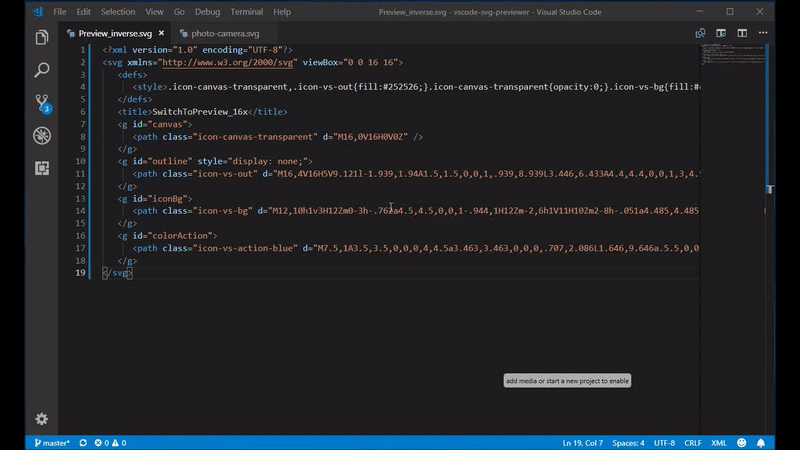
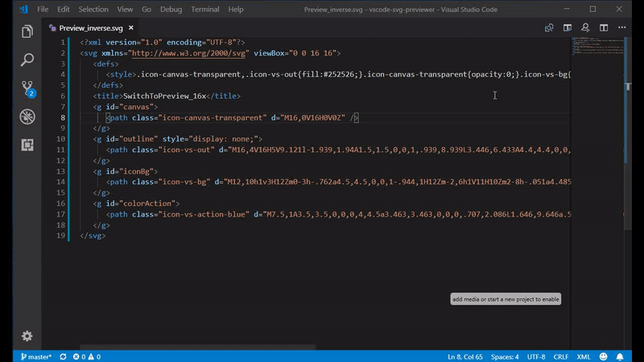
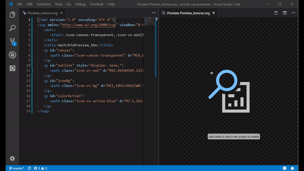

# SVG Previewer

Show SVG preview to the side from current editor. Supports live preview refresh, zoom by click and mouse wheel.

# Usage 
## Preview SVG
Preview panel can be opened by click on the menu item or by the command.

## Zoom
* Click on the image to **Zoom in**
* Click with **Ctrl** or **Command** button to **Zoom out**
* Turn the mouse wheel with **Ctrl** or **Command** to **Zoom in** or **Zoom out** the image

