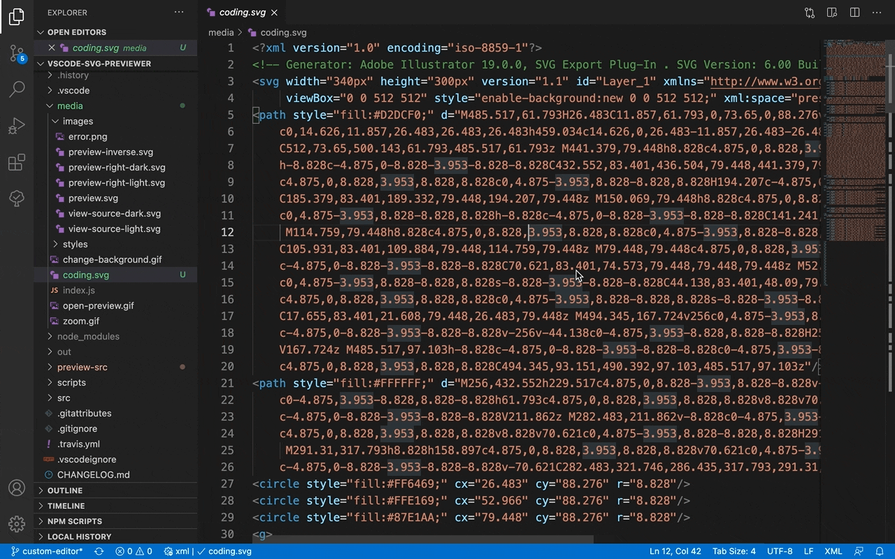
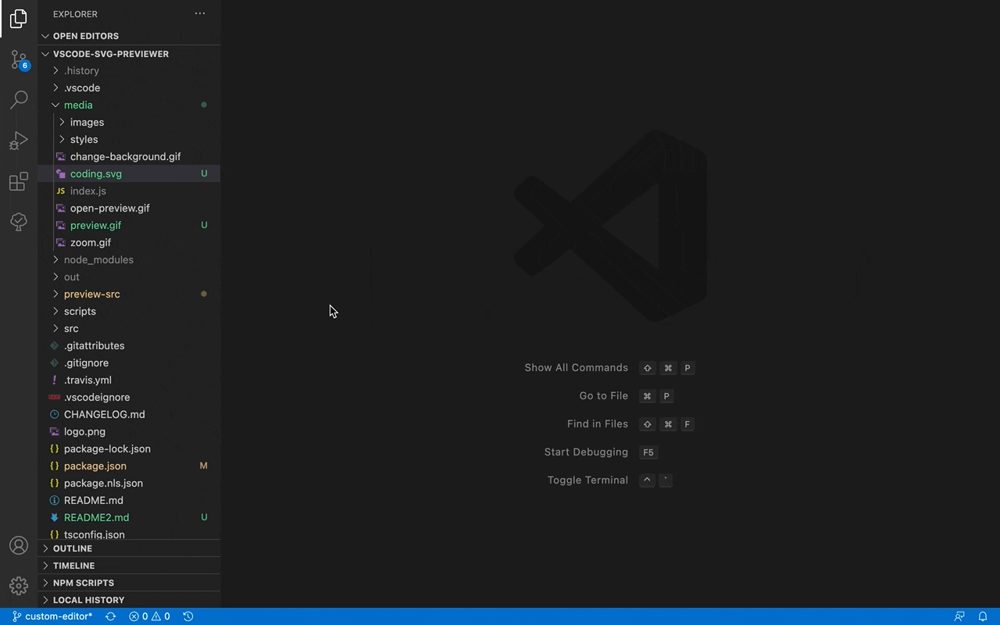

# SVG Previewer

## Preview only (instead of the code editor)

In case you want to see SVG preview by default instead of the source code.

#### How to setup?
- Open any SVG image
- Execute the command "View: Reopen Editor With..." (via Command Palette)
- Select "Image Viewer" and set it as the default

## Commands:

| Command                        | Description                          |
|--------------------------------|--------------------------------------|
| Svg: Open Preview              | Open preview to the active view column |
| Svg: Open Preview to the Side  | Open preview to the side view column |
| Svg: Show Source               | Open source file of the active preview |

## Settings:

| Property             | Description                              | Default |
|----------------------|------------------------------------------|---------|
| svg.preview.autoOpen | Open a preview to the side automatically | false   |

## Keyboard Shortcuts:

| Command                        | Keybinding                          |
|--------------------------------|--------------------------------------|
| Svg: Open Preview              | ctrl+shift+v |
| Svg: Open Preview to the Side  | ctrl+k v |
